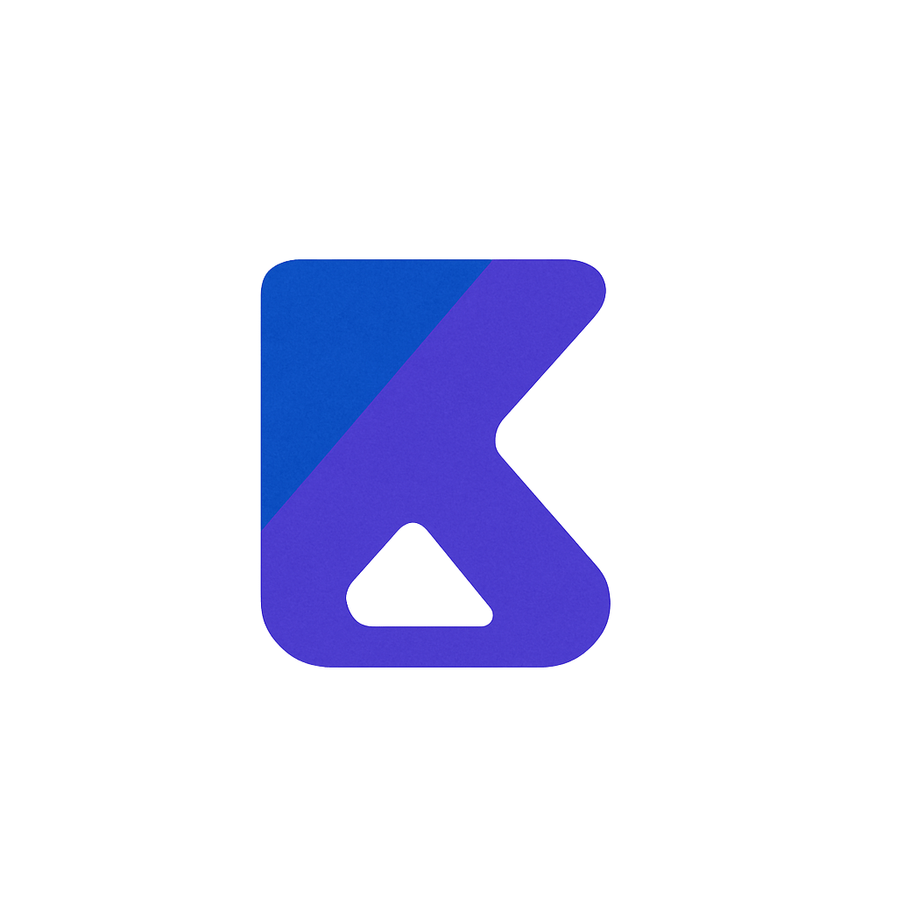
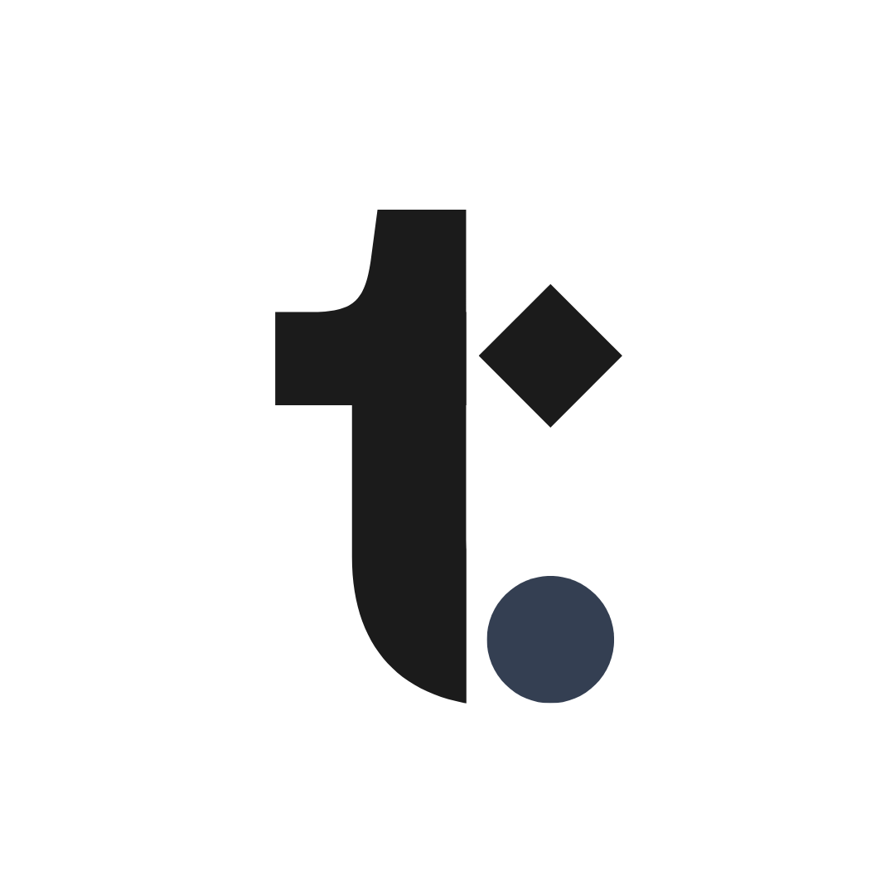

<!-- HEADER / HERO -->

 

<!-- PROFILE PICTURE WITH FOUNDER RING
<table align="center" border="0" cellpadding="0" cellspacing="0">
  <tr>
    <td align="center" style="background: linear-gradient(45deg, #4F46E5, #06B6D4); padding: 5px; border-radius: 50%;">
      
    </td>
  </tr>
</table> -->

 

<!-- TYPING EFFECT: ROLE FOCUS -->

 

<!-- MISSION STATEMENT -->

 
<h3 align="center">
  <i>"Architecting the intersection of scalable AI microservices and human-centric engineering systems."</i>
</h3>
 

<!-- VENTURE SHOWCASE: KOOPER AI -->

  <table width="100%" border="0" cellpadding="10">
    <tr>
      <td width="60%">
        <h2 style="color:#4F46E5">[ VENTURE.01 ] KOOPER AI</h2>
        
<b>Founder & AI Systems Architect</b>

        
A mission-critical AI platform built on a <b>Microservices Architecture</b>. Leveraging <b>Nx Monorepos</b>, <b>NestJS</b>, and <b>Angular Material</b> to orchestrate autonomous agents powered by <b>Groq (Llama 3)</b>.

        <ul>
          <li>Engineered <b>40+ specialized automation mini-agents</b> for internal workflows.</li>
          <li>Optimized LLM orchestration achieving <b>60% response time reduction</b>.</li>
          <li>Deployed via Docker for global scalability and production stability.</li>
        </ul>
        
        
        
        
      </td>
      <td width="40%" align="center">
        
      </td>
    </tr>
  </table>

 

<!-- VENTURE SHOWCASE: TAALOMY -->

  <table width="100%" border="0" cellpadding="10">
    <tr>
      <td width="40%" align="center">
        
      </td>
      <td width="60%">
        <h2 style="color:#06B6D4">[ VENTURE.02 ] TAALOMY</h2>
        
<b>Lead Full-Stack Engineer</b>

        
A comprehensive EdTech platform connecting institutions via a <b>Dual-App Mobile Ecosystem</b>. Redefining academic engagement through real-time data sync and institutional optimization.

        <ul>
          <li>Dual-app ecosystem for Students and Lecturers built with <b>React Native (Expo)</b>.</li>
          <li>Real-time attendance tracking via <b>WebSockets (Django Channels)</b>.</li>
          <li>Integrated timetables and secure academic record management.</li>
        </ul>
        
        
        
        
      </td>
    </tr>
  </table>

 

<!-- OTHER HIGHLIGHTS (MAZRATY / SZFD) -->
<h2 align="center">[ DEPLOYMENT HIGHLIGHTS ]</h2>

<table align="center" width="100%" border="0" cellpadding="10">
  <tr>
    <td width="50%" align="left">
      <h3>MAZRATY AGTECH</h3>
      
IoT-integrated farm monitoring mobile application with live sensor notifications and real-time visualization.

      <code>Expo</code> <code>Node.js</code> <code>IoT Sensors</code>
    </td>
    <td width="50%" align="left">
      <h3>OFFICIAL SZFD PLATFORM</h3>
      
High-fidelity web platform with AI-powered interactive features enhancing user engagement and brand presence.

      <code>React.js</code> <code>AI Ops</code> <code>UI/UX</code>
    </td>
  </tr>
</table>

 

 

<!-- ARCHITECTURAL ARSENAL (COMPREHENSIVE) -->
<h2 align="center">[ CORE ARCHITECTURE ]</h2>

  
   
  

 

  
  
  
  
  
  

 

 

<!-- GLOBAL METRICS -->
<h2 align="center">[ PERFORMANCE METRICS ]</h2>

  
  

 

<!-- SNAKE ANIMATION -->

  <picture>
    <source media="(prefers-color-scheme: dark)" srcset="https://raw.githubusercontent.com/AYZuhair/AYZuhair/output/github-contribution-grid-snake-dark.svg">
    <source media="(prefers-color-scheme: light)" srcset="https://raw.githubusercontent.com/AYZuhair/AYZuhair/output/github-contribution-grid-snake.svg">
    
  </picture>

 

<!-- ESTABLISH CONNECTION -->

 
<h2 align="center">[ ESTABLISH CONNECTION ]</h2>

  
  
  

 

<!-- SYSTEM STATUS LOG -->

 

<!-- FOOTER -->

  

